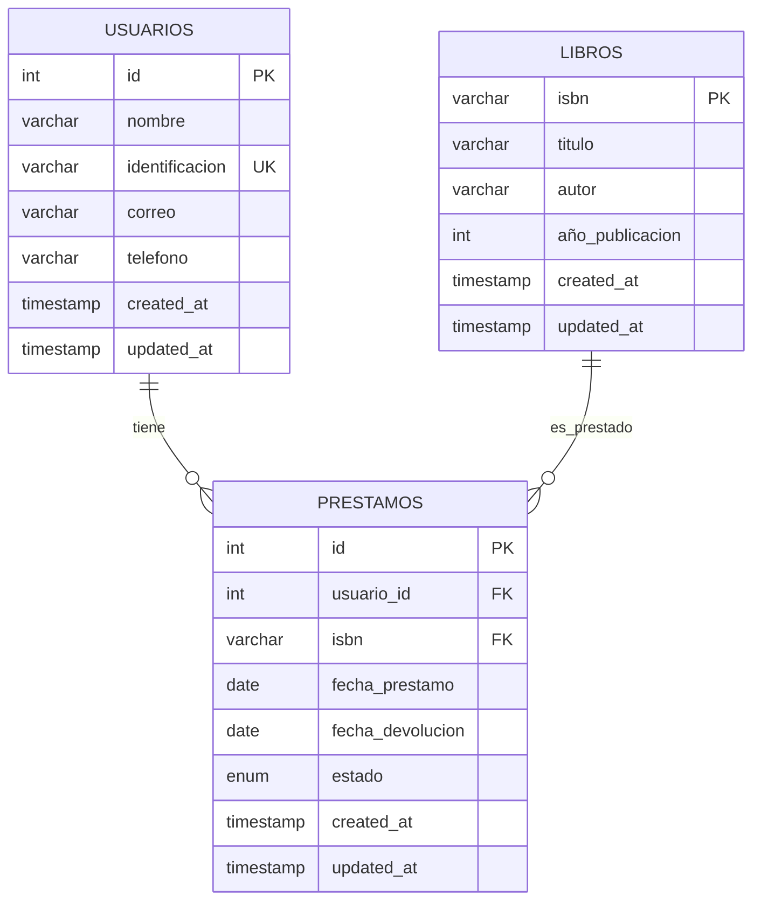

# Diagrama Entidad-Relación - Biblioteca Comunitaria "Lecturas Libres"

## Diagrama en formato Mermaid

## Descripción de las Entidades

### USUARIOS
- **id**: Clave primaria autoincremental
- **nombre**: Nombre completo del usuario
- **identificacion**: Número de identificación único
- **correo**: Dirección de correo electrónico
- **telefono**: Número de teléfono
- **created_at**: Fecha de creación del registro
- **updated_at**: Fecha de última actualización

### LIBROS
- **isbn**: Clave primaria, número ISBN del libro
- **titulo**: Título del libro
- **autor**: Nombre del autor
- **año_publicacion**: Año de publicación
- **created_at**: Fecha de creación del registro
- **updated_at**: Fecha de última actualización

### PRESTAMOS
- **id**: Clave primaria autoincremental
- **usuario_id**: Clave foránea que referencia a USUARIOS.id
- **isbn**: Clave foránea que referencia a LIBROS.isbn
- **fecha_prestamo**: Fecha en que se realizó el préstamo
- **fecha_devolucion**: Fecha límite de devolución
- **estado**: Estado del préstamo (activo, entregado, retrasado)
- **created_at**: Fecha de creación del registro
- **updated_at**: Fecha de última actualización

## Relaciones

1. **USUARIOS → PRESTAMOS**: Un usuario puede tener múltiples préstamos (1:N)
2. **LIBROS → PRESTAMOS**: Un libro puede ser prestado múltiples veces (1:N)

## Índices

- **PRESTAMOS.usuario_id**: Índice para búsquedas por usuario
- **PRESTAMOS.isbn**: Índice para búsquedas por libro
- **PRESTAMOS.estado**: Índice para filtros por estado
- **PRESTAMOS.fecha_prestamo**: Índice para ordenamiento por fecha

## Restricciones

- **Integridad referencial**: Las claves foráneas garantizan que no existan préstamos sin usuario o libro válido
- **Cascade delete**: Al eliminar un usuario o libro, se eliminan automáticamente sus préstamos asociados
- **Unique constraint**: La identificación del usuario debe ser única
- **Check constraint**: El estado del préstamo debe ser uno de los valores permitidos 